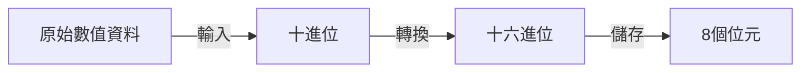
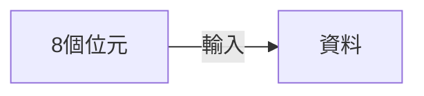

---
參考資料:
---
LENGTH，是SAS中用來定義變數儲存長度的[[SAS敘述句|敘述句]]。

當今天資料量很大時，變數的儲存長度會顯著的影響SAS執行的效率。
倘若變數的儲存長度越長越長，資料的處理則需要花費更多的時間。反之則越短。
- - -
# 背景知識
SAS數值資料的預設儲存讀取方式如下
#### 儲存

#### 讀取

- - -
# 基本語法
```SAS
LENGTH 變數名稱 ($) 儲存長度;
```

- $：若變數為文字型變數，則必須加上"\$"。
- 儲存長度：定義變數儲存長度（位元），數值型變數的儲存長度為3到8，文字變數的儲存長度為1到200。
- - -
# 備註
- 在SAS的預設中，數值變數的儲存長度為8位元；文字變數的儲存長度則是以第一次出現文字值的位元數為長度。
- LENGTH敘述句有一個小缺點，==如果資料變成十六位數後，長度長於儲存長度。==則會出現<font color=red>截斷</font>的問題，讓資料跟原始數據有些許差異。這邊以1.3在儲存長度為4的情況為例：
- - -
# 範例
```SAS

```
- - -
parent::[[SAS敘述句]]
sibling::
child::