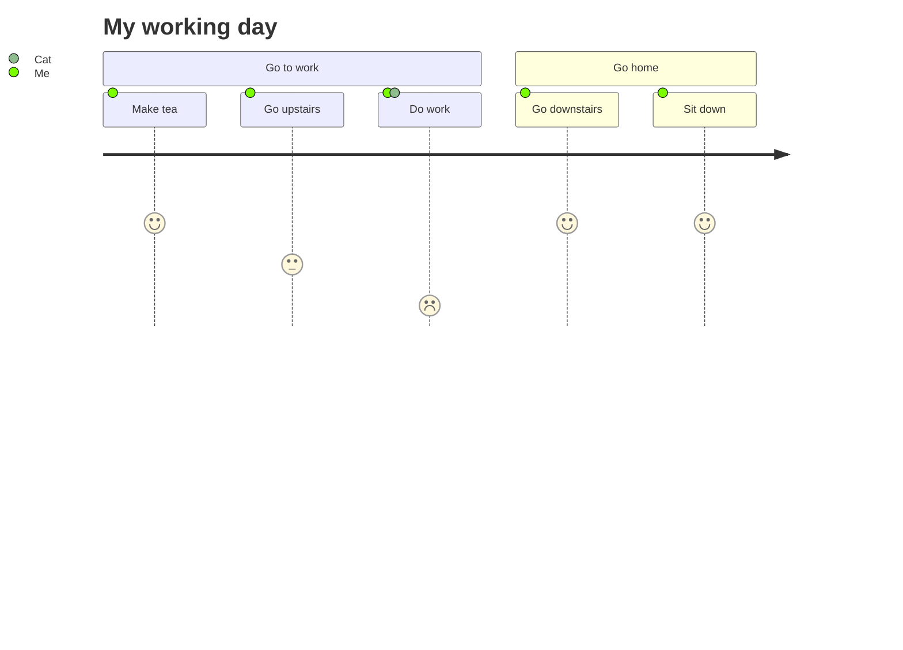

---
參考資料:
  - https://mermaid.js.org/intro/
---
在Obsidian中，我們使用Mermaid的方式是用[[程式碼區塊]]來進行
在程式碼區塊的首段，我們需要打上`mermaid`，接下來輸入我們的程式碼。
- - -
# 範例
![[Mermaid in Obsidian.png|650]]

- - -
parent::[[Mermaid]],[[程式碼區塊]]
sibling::
child::