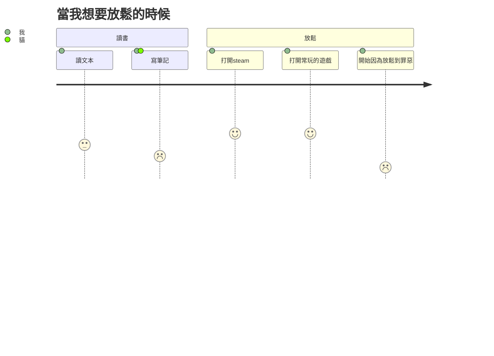

---
參考資料:
  - https://mermaid.js.org/syntax/userJourney.html
---
使用者旅程（user journey Diagram），Mermaid 支援的流程圖之一，主要用來描繪一個角色在一段旅程中做了什麼、感覺怎麼樣、誰參與了。  

常用於 User Journey Map、體驗設計、故事流程分析。
- - -
# 語法
當我們想在 Mermaid 裡建立使用者旅程圖時，只要打上 `journey`，Mermaid 就會知道接下來要畫的是使用者旅程。

#### title
然後可以打`title`表示為使用者旅程的標題，後面在未換行前，都會是標題。
```Mermaid
journey
	title 當我想要放鬆的時候
```
我們就可以把使用者旅程圖的標題設定為「當我想要放鬆的時候」

#### section 
`section`可以讓我們把使用者旅程圖分成數個階段。
```Mermaid
journey
	title 當我想要放鬆的時候
	section 讀書
		讀文本: 3: 我
		寫筆記: 2: 我,貓
	section 放鬆
		打開steam: 4: 我
		打開常玩的遊戲: 4: 我
		開始因為放鬆到罪惡: 1: 我	
```

而在每一個section（階段）中，我們可以填入一些步驟，格式會是`步驟名稱: 分數: 參與者`
需要注意的是
分數的範圍為1,2,3,4,5。
而參與者可以為複數個，可以用`,`來分隔各個使用者。
- - -
parent::[[Mermaid]]
sibling::
child::