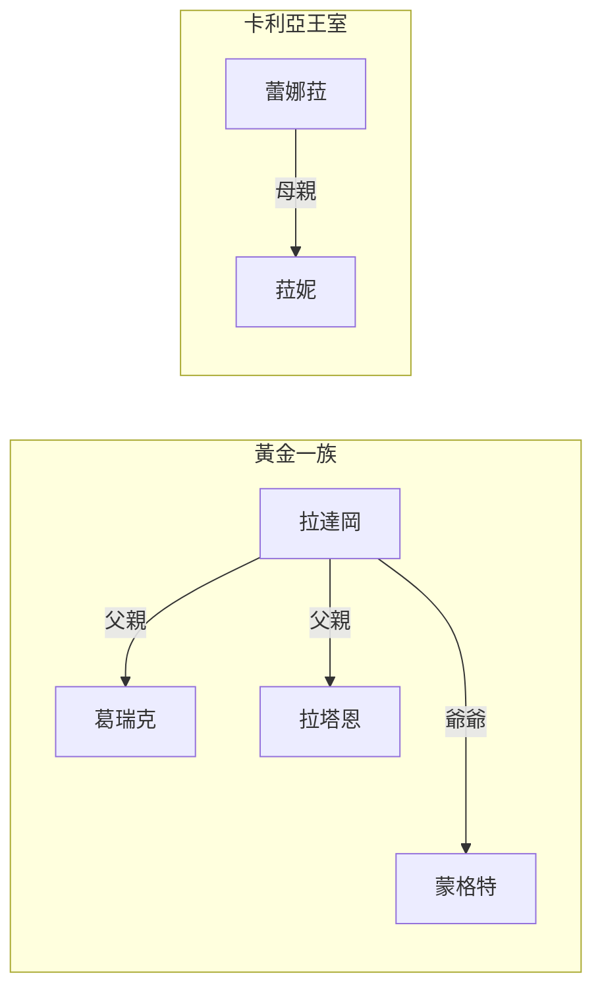
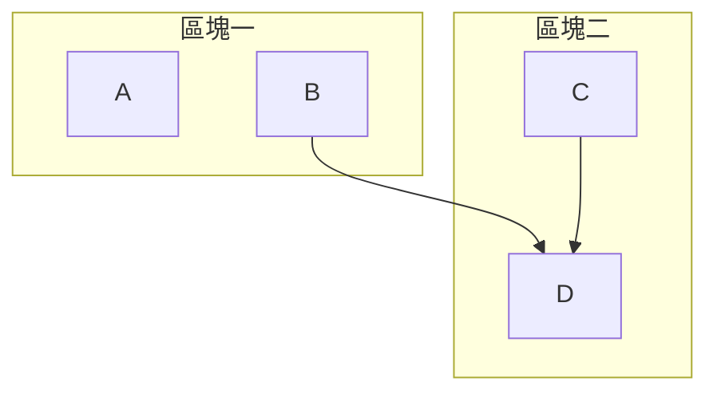
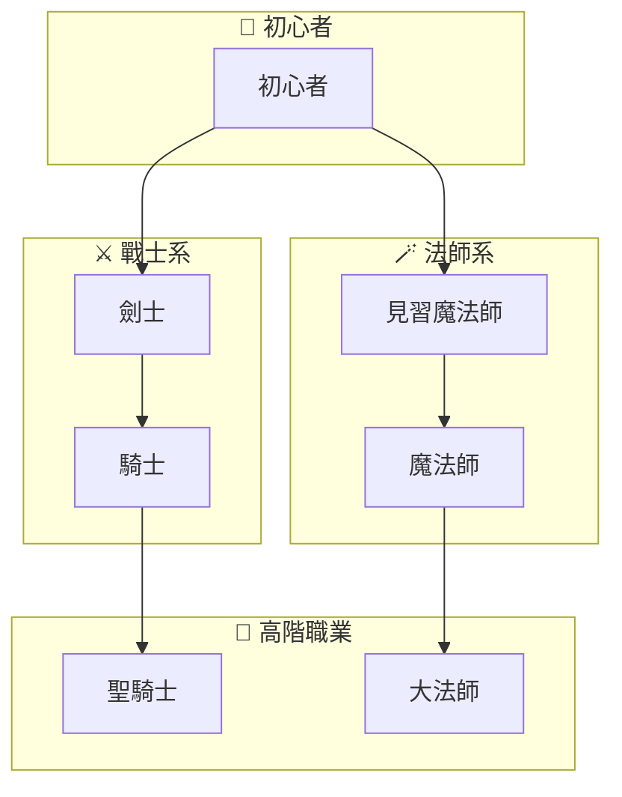

子流程區域（Subgraphs），我們今天有些情況會有需要將流程圖分區域的情況。例如你要做人物關係圖，或是有多個流程可能相關。這時候我們可以用到子流程區域的概念。

當我們要把一群節點歸類成一個區塊的時候，我們可以用
```Mermaid
subgraph 區塊名稱["標籤"]
	節點 or 連結
end
```

```Mermaid
flowchart LR
godrick[葛瑞克]
Radahn[拉塔恩]
Radagon[拉達岡]
Morgott[蒙格特]

  
Ranni[菈妮]
Rennala[蕾娜菈]

subgraph golden[黃金一族]
	Radagon -->|父親|godrick
	Radagon -->|父親|Radahn
	Radagon --->|爺爺|Morgott
end

subgraph Carian[卡利亞王室]
Rennala -->|母親|Ranni
```

當我們今天想要作區塊之間節點的連結時，我們需要在`subgraph`外去進行連結。
```Mermaid
flowchart TD
A[A]
B[B]
C[C]
D[D]

B --> D

subgraph sub1[區塊一]
	A
	B
end
subgraph sub2[區塊二]
	C --> D
end
```

你可以看到在上面的例子，我們連接了不同區塊的兩個節點B、D。

```Mermaid
flowchart TD

初心者 --> 劍士
初心者 --> 見習魔法師

劍士 --> 騎士
見習魔法師 --> 魔法師

騎士 --> 聖騎士
魔法師 --> 大法師

subgraph beginner [👶 初心者]
    初心者["初心者"]
end

subgraph warrior [⚔️ 戰士系]
    劍士["劍士"]
    騎士["騎士"]
end

subgraph mage [🪄 法師系]
    見習魔法師["見習魔法師"]
    魔法師["魔法師"]
end

subgraph advanced [🌟 高階職業]
    聖騎士["聖騎士"]
    大法師["大法師"]
end
```

- - -
parent::[[流程圖]]
sibling::
child::