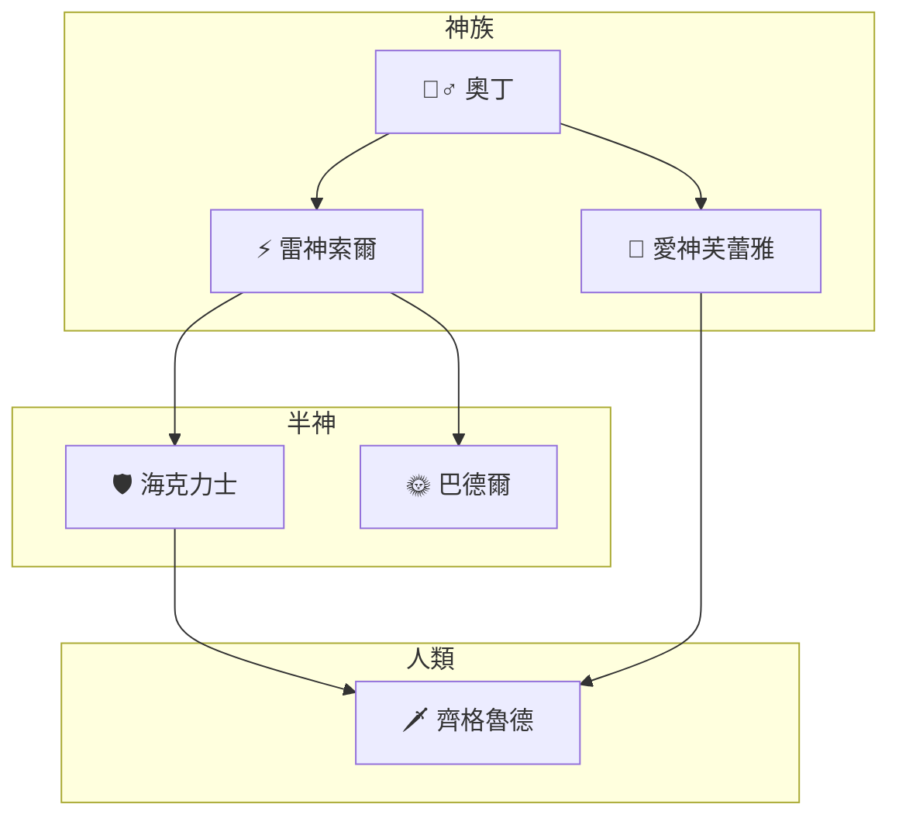

子流程區域（Subgraphs），我們今天有些情況會有需要將流程圖分區域的情況。例如你要做人物關係圖，或是有多個流程可能相關。這時候我們可以用到資流程區域

```mermaid
flowchart TD
%% 跨子圖連結
thor --> hercules
hercules --> sigurd

%% 子圖一：神
subgraph god[神族]
    odin["🧙‍♂️ 奧丁"]
    thor["⚡ 雷神索爾"]
    freya["🌸 愛神芙蕾雅"]
    odin --> thor
    odin --> freya
end

%% 子圖二：半神
subgraph demigod[半神]
    hercules["🛡️ 海克力士"]
    baldr["🌞 巴德爾"]
    thor --> baldr
end

%% 子圖三：人類
subgraph human[人類]
    sigurd["🗡️ 齊格魯德"]
    freya --> sigurd
end
```
- - -
# 參考資料

- - -
parent::
sibling::
child::