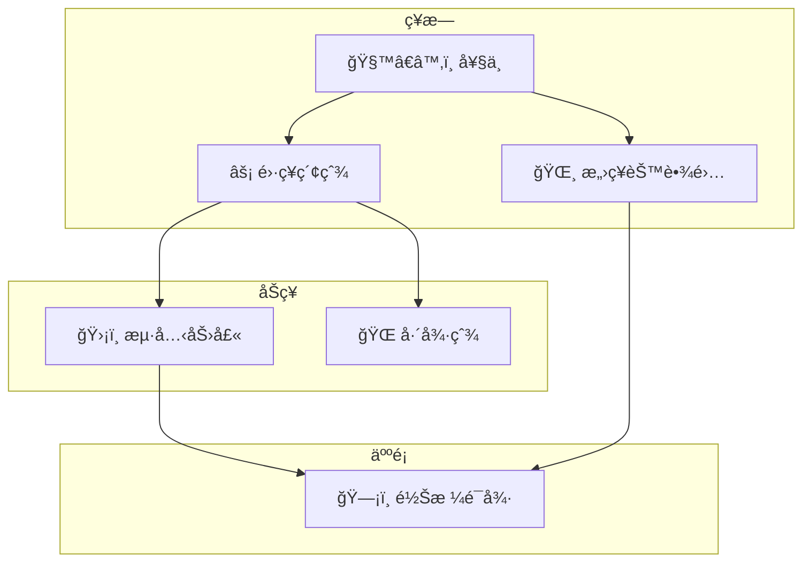

å­æµç¨‹å€åŸŸï¼ˆSubgraphs）　

```mermaid
flowchart TD

%% è·¨å­åœ–連çµ
thor --> hercules
hercules --> sigurd

%% å­åœ–一：ç¥
subgraph god[ç¥æ—]
    odin["🧙â€â™‚ï¸ å¥§ä¸"]
    thor["âš¡ é›·ç¥ç´¢çˆ¾"]
    freya["🌸 æ„›ç¥èŠ™è•¾é›…"]
    odin --> thor
    odin --> freya
end

%% å­åœ–二：åŠç¥
subgraph demigod[åŠç¥]
    hercules["ğŸ›¡ï¸ æµ·å…‹åŠ›å£«"]
    baldr["🌠巴德爾"]
    thor --> baldr
end

%% å­åœ–三：人é¡
subgraph human[人é¡]
    sigurd["ğŸ—¡ï¸ é½Šæ ¼é­¯å¾·"]
    freya --> sigurd
end
```
- - -
# åƒè€ƒè³‡æ–™

- - -
parent::
sibling::
child::