子流程區域（Subgraphs），我們今天有些情況會有需要將流程圖分區域的情況。例如你要做人物關係圖，或是有多個流程可能相關。這時候我們可以用到資流程區域

- - -
# 參考資料

- - -
parent::
sibling::
child::