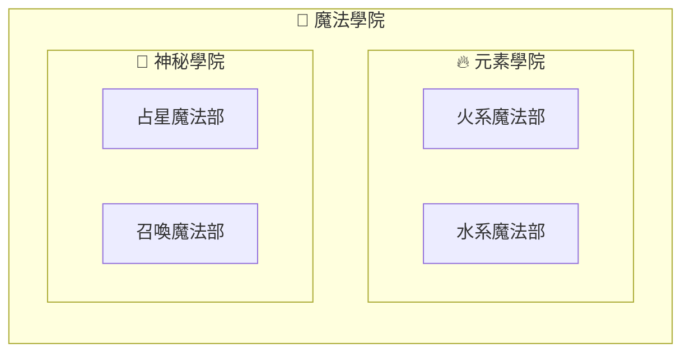

當我們今天想要在[[子流程區域|子流程區域（subgraph）]]中在做一個子流程區域。那麼我們可以用`subgraph`的區域中，再用一個`subgraph`。具體如下：
```Mermaid
flowchart LR

subgraph 魔法學院 [🏰 魔法學院]

    subgraph 元素學院 [🔥 元素學院]
        火系系部["火系魔法部"]
        水系系部["水系魔法部"]
    end

    subgraph 神秘學院 [🌙 神秘學院]
        占星系部["占星魔法部"]
        召喚系部["召喚魔法部"]
    end
end
```

- - -
# 參考資料
- [Mermaid官方 Flowcharts - Basic Syntax](https://mermaid.js.org/syntax/flowchart.html#tagged-process-tagged-rectangle)
- - -
parent::[[子流程區域]]
sibling::
child::