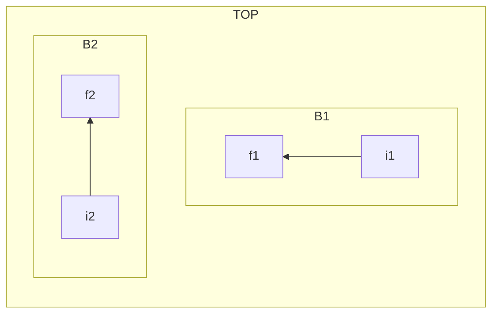

當我們今天想要控制[[子流程區域]]的[[方向]]時，我們可以透過`direction`來控制[[子流程區域]]來控制。具體方式如下：
```Mermaid
flowchart LR
  subgraph TOP
    direction TB
    subgraph B1
        direction RL
        i1 -->f1
    end
    subgraph B2
        direction BT
        i2 -->f2
    end
  end
```


`direction`的方向參數就跟流程圖的參數值一樣：
$$
\begin{array}{|c|c|}
\hline
代碼&方向
\\
\hline
\text{TD/TB}&\text{從上到下}\\
\text{BT}&\text{從下到上}\\
\text{RL}&\text{從右到左}\\
\text{LR}&\text{從左到右}\\
\hline
\end{array}
$$
- - -
# 限制
如果子圖的任何節點連結到外部，那麼子圖設定的方向會被忽略。而子圖的方向將會變成主流程圖的方向。
- - -
parent::[[子流程區域]],[[方向]]
sibling::
child::