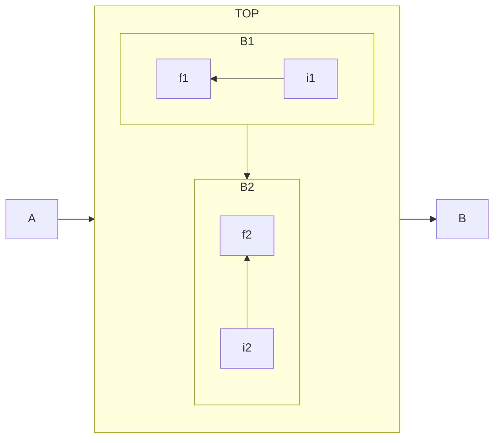

當我們今天想要控制[[子流程區域]]的[[方向]]時，我們可以透過`direction`來控制[[子流程區域]]來控制。具體方式如下：
```Mermaid
flowchart LR
  subgraph TOP
    direction TB
    subgraph B1
        direction RL
        i1 -->f1
    end
    subgraph B2
        direction BT
        i2 -->f2
    end
  end
  A --> TOP --> B
  B1 --> B2
```


- - -
# 參考資料

- - -
parent::[[子流程區域]],[[方向]]
sibling::
child::