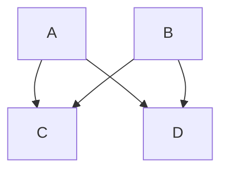

---
參考資料:
---
流程圖（Flowchart），他是用來表示演算法、流程、簡單的步驟的方法。跟大部分的圖表一樣，流程圖可以透過視覺化的方式來讓我們方便了解發生了什麼。

而通常我們會用由幾何圖形製成的[[節點目錄|節點]]（Nodes）跟由箭頭或是線條組成的[[連結目錄|邊]]（edges）來建構而成。

而在[[Mermaid]]中，我們會透過`flowchart`來做為建立流程圖的底層代碼。
- - -
# 範例
```Mermaid
flowchart TB
A --> C
A --> D
B --> C
B --> D
```


- - -
parent::[[Mermaid]]
sibling::
child::