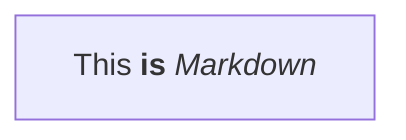

---
參考資料:
  - https://mermaid.js.org/syntax/flowchart.html
---
Markdown節點是基於文字節點來讓我們在流程圖的節點中，建立可以輸入[[Markdown]]語法的節點。我們可以在文字節點的基礎下，把我們想要輸入的Markdown文字用雙引號「"」跟反引號「\`」括起來。

```Mermaid
flowchart
markdown["`This **is** _Markdown_`"]
```


- - -
parent::[[節點目錄]],[[MarkDown]]
sibling::
child::