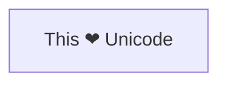

---
參考資料:
  - https://mermaid.js.org/syntax/flowchart.html
---
Unicode節點，可以讓我們在流程圖的節點中，輸入Unicode架構的內容。我們可以基於文字節點的架構，再透過「"」將unicode文字括起來，就可以在節點中輸入unicode文字。
```Mermaid
flowchart LR
id["This ❤ Unicode"]
```

- - -
# 備註
我自己在測試的時候，我發現在obsidian裡面，好像可以用文字節點就可以直接在節點中打出Unicode文字。
- - -
parent::[[節點目錄]]
sibling::
child::