---
參考資料:
  - https://mermaid.js.org/syntax/flowchart.html
---
先講一下，在寫Mermaid的流程圖相關的筆記的時候，我是邊看Mermaid官網的教學邊寫的。而我到現在才發現，流程圖很多筆記都可以用shape來寫，幹。小小抱怨一下而已，可能要新增一些筆記的內容。

在節點的建立上，我們有一個比較方便的方法可以去決定節點的形狀，就是在用`節點名稱@{ shape: 節點代號}`的方式來建立，而代號如下。


| 節點意義      | 形狀名稱     | 節點代號         | 描述       | 節點代號別名                                                        |
| --------- | -------- | ------------ | -------- | ------------------------------------------------------------- |
| 卡片        | 有缺口的矩形   | `notch-rect` | 代表一張卡片   | `card`,`notched-rectangle`                                    |
| 分割處理      | 雙線矩形     | `div-rect`   | 分割處理形狀   | `div-proc`,`divided-process`,<br>`divided-rectangle`          |
| 多重處理      | 疊加矩形     | `st-rect`    | 多重處理步驟   | `processes`,`procs`,`stacked-rectangle`                       |
| 手動輸入      | 傾斜矩形     | `sl-rect`    | 手動輸入步驟   | `manual-input`,`sloped-rectangle`                             |
| 儲存資料      | 蝴蝶領矩形    | `bow-rect`   | 儲存資料     | `bow-tie-rectangle`,`stored-data`                             |
| 有線條/陰影的矩形 | 有線條矩形    | `lin-rect`   | 有線條處理形狀  | `lin-proc`,`lined-process`,`lined-rectangle`,`shaded-process` |
| 子程序       | 框形矩形     | `fr-rect`    | 子程序      | `framed-rectangle`,`subproc`,`subprocess`,`subroutine`        |
| 被標記程序     | 被標記矩形    | `tag-rect`   | 被標記處理    | `tag-proc`,`tagged-process`,`tagged-rectangle`                |
| 註釋        | 左大括號     | `brace`      | 新增註釋     | `brace-l`,`comment`                                           |
| 右側註釋      | 右大括號     | `brace-r`    | 新增註釋     | 無                                                             |
| 雙邊註釋      | 雙大括號     | `braces`     | 新增註釋     | 無                                                             |
| 資料輸入/輸出   | 平行四邊形    | `lean-r`     | 表示輸入或輸出  | `in-out`,`lean-right`                                         |
| 資料輸出/輸入   | 逆-平行四邊形  | `lean-l`     | 表示輸出或輸入  | `lean-left`,`out-in`                                          |
| 資料庫       | 圓柱體      | `cyl`        | 資料庫儲存    | `cylinder`,`database`,`db`                                    |
| 直接存取儲存    | 水平圓柱體    | `h-cyl`      | 直接存取儲存   | `das`,`horizontal-cylinder`                                   |
| 磁碟儲存      | 有線條的圓柱體  | `lin-cyl`    | 磁碟儲存     | `disk`,`lined-cylinder`                                       |
| 接點        | 實心圓      | `f-circ`     | 接點位置     | `filled-circle`,`junction`                                    |
| 開始        | 圓形       | `circle`     | 開始點      | `start`                                                       |
| 開始（小）     | 小圓形      | `sm-circ`    | 小型開始點    | `small-circle`                                                |
| 停止        | 雙園       | `dbl-circ`   | 表示停止點    |                                                               |
| 停止（小）     | 框形圖      | `fr-circ`    | 停止點      | `framed-circle`,`stop`                                        |
| 摘要        | 交叉圓形     | `cross-circ` | 摘要       | `crossed-circle`,`summary`                                    |
| 文件        | 文件圖形     | `doc`        | 表示一份文件   | `document`                                                    |
| 多文件       | 疊加文件     | `docs`       | 多個文件     | `document`,`st-doc`,`stacled-document`                        |
| 線條文件      | 有線條的文件圖形 | `lin-doc`    | 有線條文件    | `lined-document`                                              |
| 被標記文件     | 被標記文件圖形  | `tag-doc`    | 被標記文件    | `tagged-document`                                             |
| 提取        | 三角形      | `tri`        | 提取操作     | `extract`,`triangle`                                          |
| 整理        | 沙漏       | `hourglass`  | 代表整理操作   | `collate`,`hourglass`                                         |
| 通訊連結      | 閃電       | `bolt`       | 通訊連結     | `com-link`,`lightning-bolt`                                   |
| 手動檔案      | 翻轉三角形    | `flip-tri`   | 手動檔案操作   | `flipped-triangle`,`manual-file`                              |
| 決策        | 菱形       | `diam`       | 決策步驟     | `decision`,`diamond`,`question`                               |
| 延遲        | 半圓角矩形    | `delay`      | 表示延遲     | `half-rounded-rectangle`                                      |
| 顯示        | 曲面梯形     | `curv-trap`  | 表示顯示     | `curved-trapezoid`,`display`                                  |
| 事件        | 圓角矩形     | `rounded`    | 表示事件     | `event`                                                       |
| 分支/合併     | 實心矩形     | `fork`       | 分支或合併流程  | `join`                                                        |
| 內部儲存      | 窗格       | `win-pane`   | 內部儲存     | `internal-storage`,`window-pane`                              |
| 迴圈限制      | 五邊形缺角    | `notch-pent` | 迴圈限制步驟   | `loop-limit`,`notched-pentagon`                               |
| 手動操作      | 倒置梯形     | `trap-t`     | 表示一個手動任務 | `inv-trapezoid`,`manual`,`trapezoid-top`                      |
| 奇數形狀      | 奇數圖形     | `odd`        | 奇數圖形     |                                                               |
| 紙帶        | 旗形       | `flag`       | 紙帶類型儲存   | `paper-tape`                                                  |
| 預備條件      | 六邊形      | `hex`        | 準備或條件設定  | `hexgon`,`prepare`                                            |
| 優先行動      | 倒梯形底部    | `trap-b`     | 優先處理     | `priority`,`trapezoid`,`trapezoid-bottom`                     |
| 處理        | 矩形       | `rect`       | 標準處理形狀   | `proc`,`process`,`rectangle`                                  |
| 終端點       | 跑道節點     | `stadium`    | 終端點      | `pill`,`terminal`                                             |
| 文字區塊      | 文字區塊圖形   | `text`       | 文字說明     |                                                               |
而如果你想要在節點裡面打字，那你就在`shape`後面加逗點跟`label: ""`，你就可以在雙引號裡面打字。
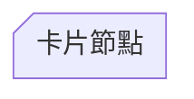
【卡片節點, `notch-rect`】

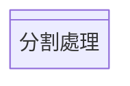
【分割處理, `div-rect`】

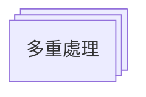
【多重處理, `st-rect`】

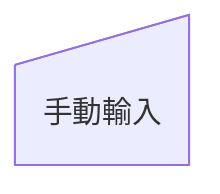
【手動輸入, `sl-rect`】

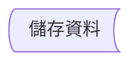
【儲存資料, `bow-rect`】

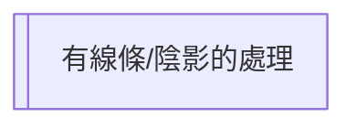
【有線條/陰影的處理, `lin-rect`】

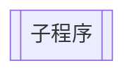
【子程序, `fr-rect`】
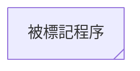
【被標記程序, `tag-rect`】
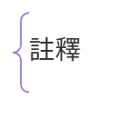
【註釋,`brace`】
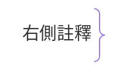
【右側註釋, `brace-r`】
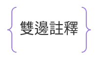
【雙邊註釋, `braces`】
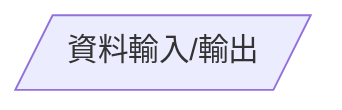
【資料輸入/輸出, `lean-r`】
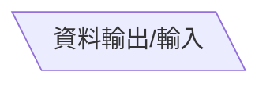
【資料輸入/輸出, `lean-l`】
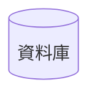
【資料庫, `cyl`】
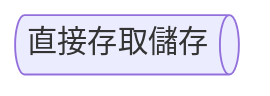
【直接存取儲存, `h-cyl`】
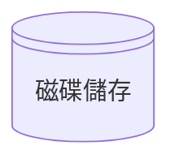
【磁碟儲存, `lin-cyl`】

【接點, `f-circ`】
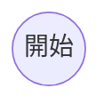
【開始, `circle`】
```mermaid
flowchart TD
A@{ shape: sm-circ,label: "開始（小）"}
```
【開始（小）, `sm-circ`】
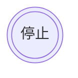
【停止, `dbl-circ`】
```mermaid
flowchart TD
A@{ shape: fr-circ,label: "停止（小）"}
```
【停止（小）, `fr-circ`】
```mermaid
flowchart TD
A@{ shape: cross-circ,label: "摘要"}
```
【摘要, `cross-circ`】
```mermaid
flowchart TD
A@{ shape: tri,label: "提取"}
```
【提取, `tri`】
```mermaid
flowchart TD
A@{ shape: hourglass,label: "整理"}
```
【整理, `hourglass`】
```mermaid
flowchart TD
A@{ shape: bolt,label: "通訊連結"}
```
【通訊連結, `bolt`】
```mermaid
flowchart TD
A@{ shape: flip-tri,label: "手動檔案"}
```
【手動檔案, `flip-tri`】
```mermaid
flowchart TD
A@{ shape: diam,label: "菱形"}
```
【菱形, `diam`】
```mermaid
flowchart TD
A@{ shape: delay,label: "延遲"}
```
【延遲, `delay`】
```mermaid
flowchart TD
A@{ shape: curv-trap,label: "顯示"}
```
【顯示, `curv-trap`】
```mermaid
flowchart TD
A@{ shape: doc,label: "文件"}
```
【文件, `doc`】
```mermaid
flowchart TD
A@{ shape: docs,label: "多文件"}
```
【多文件, `docs`】
```mermaid
flowchart TD
A@{ shape: lin-doc,label: "線條文件"}
```
【線條文件, `lin-doc`】
```mermaid
flowchart TD
A@{ shape: tag-doc,label: "被標記文件"}
```
【被標記文件, `tag-doc`】
```mermaid
flowchart TD
A@{ shape: rounded,label: "事件"}
```
【事件, `rounded`】
```mermaid
flowchart TD
A@{ shape: fork,label: "分支/合併"}
```
【分支/合併, `fork`】
```mermaid
flowchart TD
A@{ shape: win-pane,label: "內部儲存"}
```
【內部儲存, `win-pane`】
```mermaid
flowchart TD
A@{ shape: notch-pent,label: "迴圈限制"}
```
【迴圈限制, `notch-pent`】
```mermaid
flowchart TD
A@{ shape: trap-t,label: "手動操作"}
```
【手動操作, `trap-t`】
```mermaid
flowchart TD
A@{ shape: odd,label: "奇數形狀"}
```
【奇數形狀, `odd`】
```mermaid
flowchart TD
A@{ shape: flag,label: "紙帶"}
```
【紙帶, `flag`】
```mermaid
flowchart TD
A@{ shape: hex,label: "預備條件"}
```
【預備條件, `hex`】
```mermaid
flowchart TD
A@{ shape: trap-b,label: "優先行動"}
```
【優先行動, `trap-b`】
```mermaid
flowchart TD
A@{ shape: rect,label: "處理"}
```
【處理, `rect`】
```mermaid
flowchart TD
A@{ shape: stadium,label: "終端點"}
```
【終端點, `stadium`】
```mermaid
flowchart TD
A@{ shape: text,label: "文字區塊"}
```
【文字區塊, `text`】

- - -
parent::[[節點目錄]]
sibling::
child::