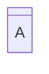

先講一下，在寫Mermaid的流程圖相關的筆記的時候，我是邊看Mermaid官網的教學邊寫的。而我到現在才發現，流程圖很多筆記都可以用shape來寫，幹。小小抱怨一下而已，可能要新增一些筆記的內容。

在節點的建立上，我們有一個比較方便的方法可以去決定節點的形狀，就是在用`節點名稱@{ shape: 節點代號}`的方式來建立，而代號如下。

| 節點意義      | 形狀名稱     | 節點代號         | 描述      | 節點代號別名                                               |
| --------- | -------- | ------------ | ------- | ---------------------------------------------------- |
| 卡片        | 有缺口的矩形   | `notch-rect` | 代表一張卡片  | `card`,`notched-rectangle`                           |
| 分割處理      | 雙線矩形     | `div-rect`   | 分割處理形狀  | `div-proc`,`divided-process`, `divided-rectangle` |
| 註釋        | 左大括號     | `brace`      | 新增註釋    | `brace-l`,`comment`                                  |
| 右側註釋      | 右大括號     | `brace-r`    | 新增註釋    | 無                                                    |
| 雙邊註釋      | 雙大括號     | `braces`     | 新增註釋    | 無                                                    |
| 資料輸入/輸出   | 平行四邊形    | `lean-r`     | 表示輸入或輸出 | `in-out`,`lean-right`                                |
| 資料輸出/輸入   | 逆-平行四邊形  | `lean-l`     | 表示輸出或輸入 | `lean-left`,`out-in`                                 |
| 資料庫       | 圓柱體      | `cyl`        | 資料庫儲存   | `cylinder`,`database`,`db`                           |
| 直接存取儲存    | 水平圓柱體    | `h-cyl`      | 直接存取儲存  | `das`,`horizontal-cylinder`                          |
| 磁碟儲存      | 有線條的圓柱體  | `lin-cyl`    | 磁碟儲存    | `disk`,`lined-cylinder`                              |
| 整理        | 沙漏       | `hourglass`  | 代表整理操作  | `collate`,`hourglass`                                |
| 通訊連結      | 閃電       | `bolt`       | 通訊連結    | `com-link`,`lightning-bolt`                          |
| 決策        | 菱形       | `diam`       | 決策步驟    | `decision`,`diamond`,`question`                      |
| 延遲        | 半圓角矩形    | `delay`      | 表示延遲    | `half-rounded-rectangle`                             |
| 顯示        | 曲面梯形     | `curv-trap`  | 表示顯示    | `curved-trapezoid`,`display`                         |
| 文件        | 文件圖形     | `doc`        | 表示一份文件  | `document`                                           |
| 事件        | 圓角矩形     | `rounded`    | 表示事件    | `event`                                              |
| 提取        | 三角形      | `tri`        | 提取操作    | `extract`,`triangle`                                 |
| 分支/合併     | 實心矩形     | `fork`       | 分支或合併流程 | `join`                                               |
| 內部儲存      | 窗格       | `win-pane`   | 內部儲存    | `internal-storage`,`window-pane`                     |
| 接點        | 實心圓      | `f-circ`     | 接點位置    | `filled-circle`,`junction`                           |
| 線條文件      | 有線條的文件圖形 | `lin-doc`    | 有線條文件   | `lined-document`                                     |
| 有線條/陰影的矩形 |          |              |         |                                                      |
|           |          |              |         |                                                      |
|           |          |              |         |                                                      |
|           |          |              |         |                                                      |

- - -
# 參考資料
- [Flowcharts - Basic Syntax](https://mermaid.js.org/syntax/flowchart.html)
- - -
parent::[[節點目錄]]
sibling::
child::