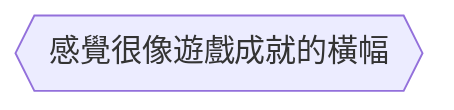

當我們今天要建立一個六邊形的節點時，我們可以在預設節點後面加入`{{}}`，來得到六邊形的節點。
```Mermaid
flowchart
id1{{感覺很像遊戲成就的橫幅}}
```

也可以透過[[shape節點]]的方式來建立節點。
```Mermaid
flowchart TD
A@{ shape: hex,label: "感覺很像遊戲成就的橫幅"}
```

- - -
parent::[[節點目錄]]
sibling::[[shape節點]]
child::