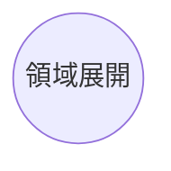

---
參考資料:
  - https://mermaid.js.org/syntax/flowchart.html
---
如果我們今天要把節點變成圓形的，那我們可以在預設節點後面加上`(())`。
```Mermaid
flowchart
id((領域展開))
```

也可以透過[[shape節點]]的方式來建立節點。
```Mermaid
flowchart TD
A@{ shape: circle,label: "領域展開"}
```

- - -
parent::[[節點目錄]]
sibling::[[shape節點]]
child::