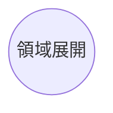
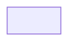
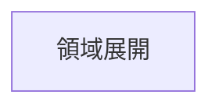

如果我們今天要把節點變成圓形的，那我們可以在預設節點後面加上`(())`。
```Mermaid
flowchart
id((領域展開))
```



- - -
# 參考資料
- [Flowcharts - Basic Syntax](https://mermaid.js.org/syntax/flowchart.html)
- - -
parent::[[節點目錄]]
sibling::
child::