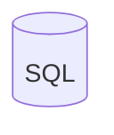
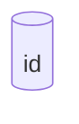

---
參考資料:
  - https://mermaid.js.org/syntax/flowchart.html
---
如果我們要建立一個圓柱形的節點，我們可以在預設節點後面加`[()]`來把節點變成圓柱形的。
```Mermaid
flowchart
id[( SQL )]
```

也可以透過[[shape節點]]的方式來建立節點。
```Mermaid
flowchart
id@{shape: cyl}
```


- - -
parent::[[節點目錄]]
sibling::[[shape節點]]
child::