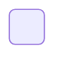
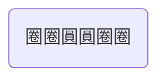

---
參考資料:
  - https://mermaid.js.org/syntax/flowchart.html
---
當我們今天想要改變一下節點的形狀，改成圓角的節點，那我們可以在預設節點後面打一個小括號，就可以把節點用成圓角節點。小括號裡面可以打任何你想打的字。
```Mermaid
flowchart 
id1( )
```

```Mermaid
flowchart
id(圈圈圓圓圈圈)
```

也可以透過[[shape節點]]的方式來建立節點。
```Mermaid
flowchart TD
A@{ shape: rounded,label: "圈圈圓圓圈圈"}
```

- - -
parent::[[節點目錄]]
sibling::[[shape節點]]
child::