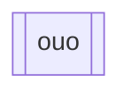

如果我們想要在節點的左右邊放垂直線，我們可以透過在預設節點後面放兩個中括號來建立。
```Mermaid
flowchart
id[[owo]]
```


也可以透過[[shape節點]]的方式來建立節點。
```Mermaid
flowchart
id@{shape: fr-rect, label: "ouo"}
```

- - -
parent::[[節點目錄]]
sibling::[[shape節點]]
child::