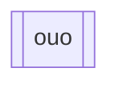

如果我們想要在節點的左右邊放垂直線，我們可以透過在預設節點後面放兩個中括號來建立。
```Mermaid
flowchart
id[[owo]]
```

- - -
# 參考資料
- [Flowcharts - Basic Syntax](https://mermaid.js.org/syntax/flowchart.html)
- - -
parent::[[節點目錄]]
sibling::
child::