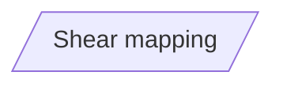
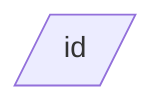

當我們要建立一個平行四邊形的節點時，我們可以在預設節點後面加入`[//]`來建立平行四邊形。
```Mermaid
flowchart
id[/Shear mapping/]
```

也可以透過[[shape節點]]的方式來建立節點。
```Mermaid
flowchart
id@{shape: lean-r}
```

- - -
parent::[[節點目錄]]
sibling::[[shape節點]]
child::