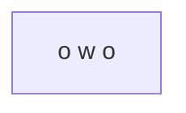
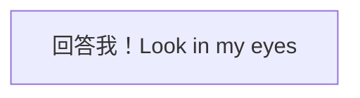

如果我們今天想要輸入一串沒有連著的文字，例如句子，那麼我們可以使用文字節點。
而我們也可以設定不是「ID」的文字。

```Mermaid
flowchart
ID[o w o]
```

```mermaid
flowchart
ID[o w o]
```
```Mermaid
flowchart
A[回答我！ Look in my eyes]
```

```mermaid
flowchart
ID[回答我！Look in my eyes]
```
- - -
parent::[[節點目錄]]
sibling::
child::