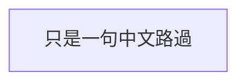

如果我們今天想要輸入一串沒有連著的文字，例如句子，那麼我們可以使用文字節點。
而我們也可以設定不是「ID」的文字。

```Mermaid
flowchart
ID[只是一句中文路過]
```


- - -
# 參考資料
- [Flowcharts - Basic Syntax](https://mermaid.js.org/syntax/flowchart.html)
- - -
parent::[[節點目錄]]
sibling::
child::