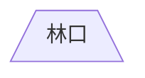

當我們要建立一個梯形節點時，我們可以在預設節點後面加入`[/\]`。

```mermaid
flowchart
id[/林口\]
```
- - -
# 參考資料
- [Flowcharts - Basic Syntax](https://mermaid.js.org/syntax/flowchart.html)
- - -
parent::[[節點目錄]]
sibling::
child::