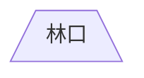

---
參考資料:
  - https://mermaid.js.org/syntax/flowchart.html
---
當我們要建立一個梯形節點時，我們可以在預設節點後面加入`[/\]`。
```Mermaid
flowchart
id[/林口\]
```

也可以透過[[shape節點]]的方式來建立節點。
```Mermaid
flowchart TD
A@{ shape: trap-b,label: "林口"}
```


- - -
parent::[[節點目錄]]
sibling::[[shape節點]]
child::