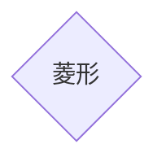

---
參考資料:
  - https://mermaid.js.org/syntax/flowchart.html
---
如果今天我們想要建立一個菱形的節點，我們可以透過在預設節點後面加入`{}`來建立菱形的節點。
```Mermaid
flowchart
id{菱形}
```

也可以透過[[shape節點]]的方式來建立節點。
```Mermaid
flowchart TD
A@{ shape: diam,label: "菱形"}
```

- - -
parent::[[節點目錄]]
sibling::[[shape節點]]
child::

