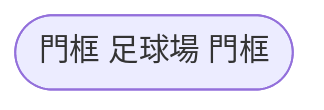

---
參考資料:
  - https://mermaid.js.org/syntax/flowchart.html
---
如果我們要把節點變成像操場的跑道那樣，我們可以透過以下的方法來定義。
```Mermaid
flowchart
id([門框 足球場 門框])
```

也可以透過[[shape節點]]的方式來建立節點。
```Mermaid
flowchart TD
A@{ shape: stadium,label: "門框 足球場 門框"}
```

- - -
parent::[[節點目錄]]
sibling::[[shape節點]]
child::