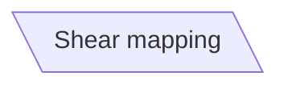

當我們要建立一個平行四邊形的節點時，我們可以在預設節點後面加入`[\\]`來建立逆-平行四邊形。
```Mermaid
flowchart
id[\Shear mapping\]
```

- - -
# 參考資料
- [Flowcharts - Basic Syntax](https://mermaid.js.org/syntax/flowchart.html)
- - -
parent::[[節點目錄]]
sibling::
child::