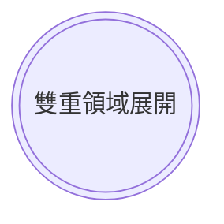

---
參考資料:
  - https://mermaid.js.org/syntax/flowchart.html
---
如果我們要建立一個雙層圓形節點，我們可以在預設節點後面加`((()))`來建立。
```Mermaid
flowchart
id((( 雙重領域展開 )))
```

也可以透過[[shape節點]]的方式來建立節點。
```Mermaid
flowchart TD
A@{ shape: dbl-circ,label: "雙重領域展開"}
```

- - -
parent::[[節點目錄]]
sibling::[[shape節點]]
child::