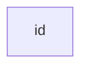
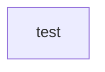
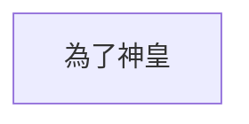

---
參考資料:
  - https://mermaid.js.org/syntax/flowchart.html
---
當我們今天想要建立一個節點的時候，我們可以直接在`flowchart`中打入任何連著的字，就會有框著你打的字的節點。

```Mermaid
flowchart 
id
```



```Mermaid
flowchart
test
```



```Mermaid
flowchart
為了神皇
```



- - -
parent::[[節點目錄]]
sibling::
child::