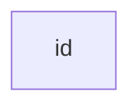
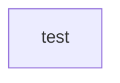

當我們今天想要建立一個節點的時候，我們可以直接在`flowchart`中打入任何連著的字，就會有框著你打的字的節點。

```Mermaid
flowchart LR
id
```


```mermaid
flowchart LR
id
```

```Mermaid
flowchart LR
test
```


```mermaid
flowchart LR
test
```

- - -
# 參考資料

- - -
parent::
sibling::
child::