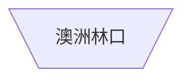

---
參考資料:
  - https://mermaid.js.org/syntax/flowchart.html
---
如果我們要建立一個顛倒的梯形節點時，我們可以在預設節點後面加上`[\/]`來建立顛倒梯形節點。
```Mermaid
flowchart
id[\/]
```

```Mermaid
flowchart TD
A@{ shape: trap-t,label: "澳洲林口"}
```

- - -
parent::[[節點目錄]]
sibling::[[shape節點]]
child::