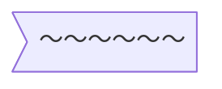

---
參考資料:
  - https://mermaid.js.org/syntax/flowchart.html
---
當我們今天想要建立一個類似旗子的節點時，我們可以透過在預設節點後面輸入`>]`來建立節點。
```Mermaid
flowchart
id> o-]
```

也可以透過[[shape節點]]的方式來建立節點。
```Mermaid
flowchart TD
A@{ shape: odd,label: "～～～～～～"}
```


- - -
parent::[[節點目錄]]
sibling::[[shape節點]]
child::