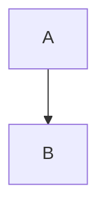
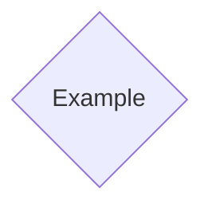

我覺得在大家認識很多不同的連結前，我們先知道連結是怎麼運作的。
mermaid的流程圖是由兩個東西構成，一個是節點，另外一個是連結。
在mermaid中，我們通常會有兩個以上的節點。而節點的建立方式有兩個。
一個另外一個方式是，透過連結來建立。直接用範例解釋：
```Mermaid
flowchart TD
A --> B
```

你可以看到，我們雖然沒有用第一種方式來建立節點，AB節點還是因為連結的關係被自動建立出來了。
是我們直接建立節點，例如以下：
```Mermaid
flowchart TD
A@{ shape: diam , label: Example }
```

我們建立了一個代號為A的菱形節點。雖然節點裡面叫做"Example"，但他真正的名字還是最前面的A。這也是我們最主要建立節點的方式。


- - -
```dataview
list
from "知識/程式語言/Mermaid/語法/流程圖/連結目錄"
where file.folder="知識/程式語言/Mermaid/語法/流程圖/連結目錄"
```
- - -
parent::[[流程圖]]

