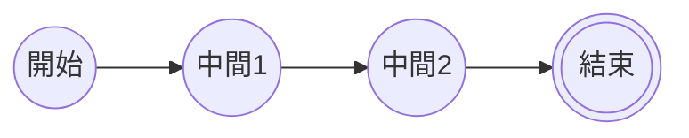
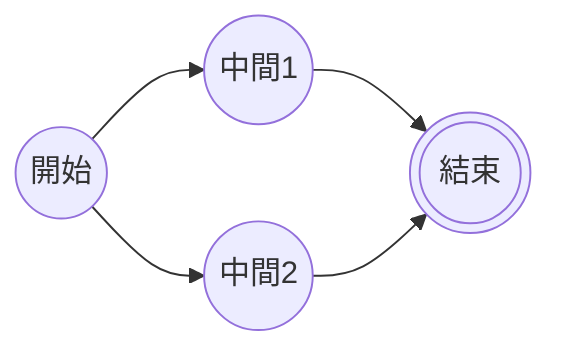
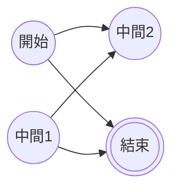

終於到有趣的地方了。多重連結，顧名思義我們可以在一張流程圖裡面建立多個節點之間的連結。例如一個正常的線性流程，或是有分流的流程，也可以是錯綜複雜的連結。我們這邊一一敘述。
- - -
# 線性連結
我們可以在同一行中把許多節點連成一條線性的流程，如下所示：
```Mermaid
flowchart LR
A@{ shape: circle , label: "開始"}
B@{ shape: circle , label: "中間1"}
C@{ shape: circle , label: "中間2"}
D@{ shape: dbl-circ , label: "結束"}
A --> B --> C --> D
```

# 分支連結
我們也可以透過`&`讓節點同時連結：
```Mermaid
flowchart LR
A@{ shape: circle , label: "開始"}
B@{ shape: circle , label: "中間1"}
C@{ shape: circle , label: "中間2"}
D@{ shape: dbl-circ , label: "結束"}
A --> B & C --> D
```

當然，我們也可以同時用好幾個`&`
```Mermaid
flowchart LR
A@{ shape: circle , label: "開始"}
B@{ shape: circle , label: "中間1"}
C@{ shape: circle , label: "中間2"}
D@{ shape: dbl-circ , label: "結束"}
A & B --> C & D
```

# 迴圈
我們也可以透過連結的方

- - -
parent::[[連結目錄]]