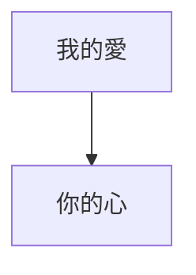
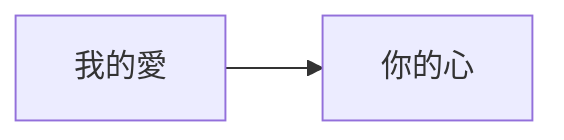

方向（Direction），因為是流程圖的關係，所以流程圖一定會有方向性，例如從左到右、從上到下之類的。而在mermaid裡面我們可以在`flowchart`後面定義流程圖的方向。如下面所示

```Mermaid
flowchart TD
我的愛 --> 你的心
```

你可以看到在`flowchart`後面有一個`TD`，那個就是定義流程圖的方向要從上到下。
如果需要其他方向的話，可以把`TD`改成以下。
$$
\begin{array}{|c|c|}
\hline
代碼&方向
\\
\hline
\text{TD/TB}&\text{從上到下}\\
\text{BT}&\text{從下到上}\\
\text{RL}&\text{從右到左}\\
\text{LR}&\text{從左到右}\\
\hline
\end{array}
$$
```Mermaid
flowchart LR
我的愛 --> 你的心
```

- - -
parent::[[連結目錄]]
sibling::
child::