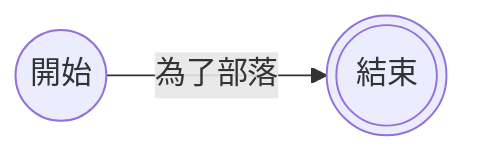

當我們今天要用mermaid建立流程圖時，我們可以透過`節點名字-->|你想輸入的文字|節點名字`的方式，將連結設定為有文字的箭頭連結。
```Mermaid
flowchart LR
A@{shape: circle, label: "開始"}
B@{shape: dbl-circ, label: "結束"}
A -->|為了部落| B
```

```Mermaid
flowchart LR
A@{shape: circle, label: "開始"}
B@{shape: dbl-circ, label: "結束"}
A -->|為了部落| B
```
```mermaid
flowchart LR
A@{shape: circle, label: "開始"}
B@{shape: dbl-circ, label: "結束"}
A -- |為了聯盟| B
```
- - -
# 參考資料
- [Flowcharts - Basic Syntax](https://mermaid.js.org/syntax/flowchart.html)
- - -
parent::[[連結目錄]]
sibling::
child::