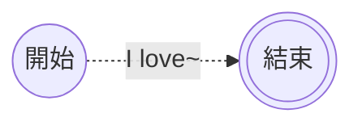

---
參考資料:
  - https://mermaid.js.org/syntax/flowchart.html
---
當我們今天要用mermaid建立流程圖時，我們可以透過`節點名字-. 你想輸入的文字 .->節點名字`的方式，將連結設定為有文字的虛線箭頭連結。
```Mermaid
flowchart LR
A@{shape: circle, label: "開始"}
B@{shape: dbl-circ, label: "結束"}
A -. I love~ .-> B
```

- - -
parent::[[連結目錄]]
sibling::[[虛線箭頭連結]]
child::