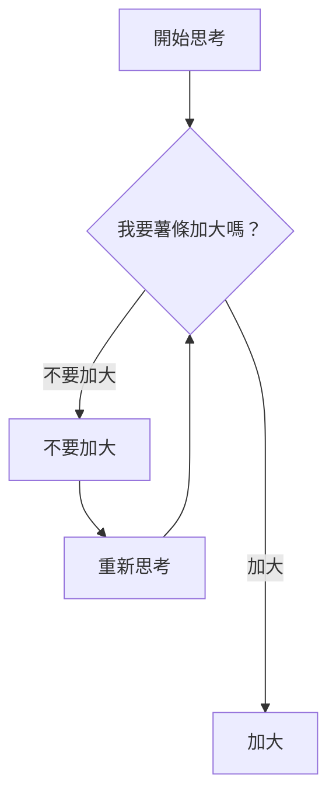
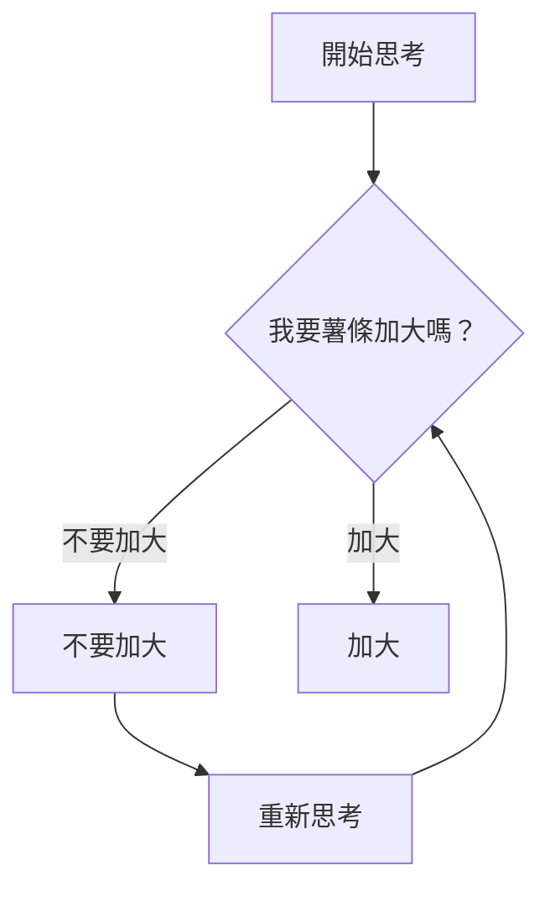
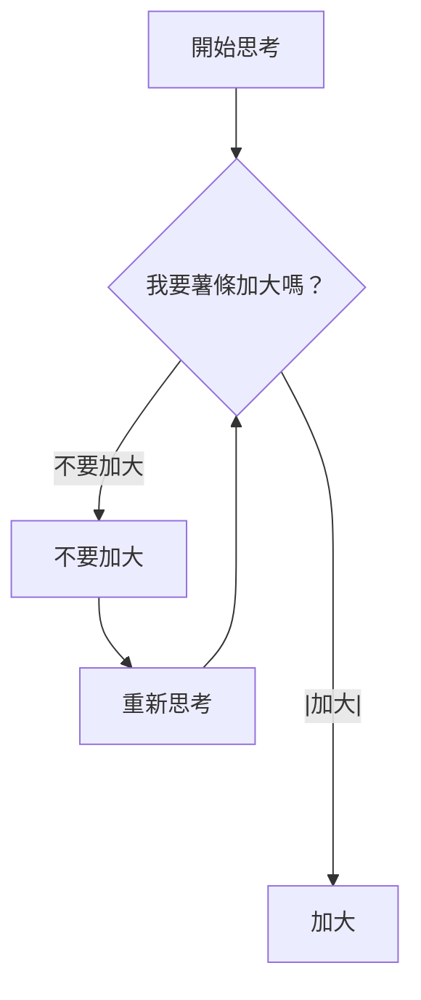

---
參考資料:
  - https://mermaid.js.org/syntax/flowchart.html
---
當我們今天要做流程圖的時候，有可能會遇到需要改變連結長度的狀況，例如以下的流程圖：
```Mermaid
flowchart TD
A[開始思考]
B@{shape: diam, label: 我要薯條加大嗎？}
C[不要加大]
D[重新思考]
E[加大]
A --> B
B -->|不要加大| C
C --> D
D --> B
B ----->|加大| E
```

而我們要把長度改變的方法，就是在想要加長的節點多加幾個`-`。
為什麼要加長，因為美觀。
如果我們今天不加長，那上面那張圖會變成如下的樣子：


如果是有文字的連結，且標籤在連結中間時，我們要加長連結長度就需要添加在連結右側。
```Mermaid
flowchart TD
A[開始思考]
B@{shape: diam, label: 我要薯條加大嗎？}
C[不要加大]
D[重新思考]
E[加大]
A --> B
B -->|不要加大| C
C --> D
D --> B
B --|加大|-----> E
```

- - -
對於不同連結類型，我們要新增的字元如下表：

$$
\begin{array}{|c|c|c|}
\hline
\text{長度}&1&2&3\\
\hline
\text{一般連結}&\text{---}&\text{----}&\text{-----}\\
\hline
\text{箭頭連結}&\text{-->}&\text{--->}&\text{---->}\\
\hline
\text{粗連結}&\text{===}&\text{====}&\text{=====}\\
\hline
\text{粗箭頭連結}&\text{==>}&\text{===>}&\text{====>}\\
\hline
\text{虛線連結}&\text{-.-}&\text{-..-}&\text{-...-}\\
\hline
\text{虛線箭頭連結}&\text{-.->}&\text{-..->}&\text{-...->}\\
\hline
\end{array}
$$


- - -
parent::[[連結目錄]]
sibling::
child::