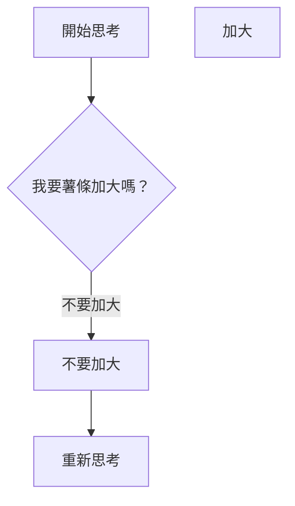

當我們今天要做流程圖的時候，有可能會遇到需要改變連結長度的狀況，例如以下的流程圖：

```mermaid
flowchart TD
A[開始思考]
B@{shape: diam, label: 我要薯條加大嗎？}
C[不要加大]
D[重新思考]
E[加大]
A --> B
B -->|不要加大| C
C --> D

```

- - -
# 參考資料
- [Flowcharts - Basic Syntax](https://mermaid.js.org/syntax/flowchart.html)
- - -
parent::[[連結目錄]]
sibling::
child::