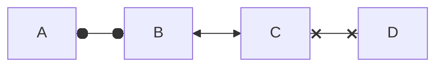

---
參考資料:
  - https://mermaid.js.org/syntax/flowchart.html
---
我們可以透過mermaid來建立流程圖中的雙向連結，其中有[[圓形連結]],[[x連結]],[[箭頭連結]]這三種連結做為雙向連結。
```Mermaid
flowchart LR
A o--o B <-->C x--x D
```


- - -
parent::
sibling::
child::