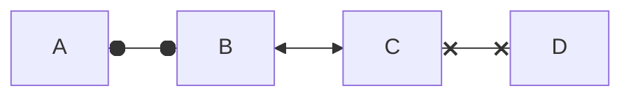

我們可以透過mermaid來建立流程圖中的雙向連結，其中有[[圓形連結]],[[x連結]],[[箭頭連結]]這三種連結做為雙向連結。
```Mermaid
flowchart LR
A o--o B <-->C x--x D
```

```mermaid
flowchart LR
A o--o B <-->C x--x D
```

- - -
# 參考資料

- - -
parent::
sibling::
child::