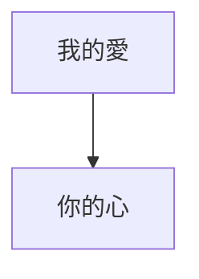

方向（Direction），因為是流程圖的關係，所以流程圖一定會有方向性，例如從左到右、從上到下之類的。而在mermaid裡面我們可以在`flowchart`後面定義流程圖的方向。如下面所示

```Mermaid
flowchart TD
我的愛 --> 你的心
```

你可以看到在`flowchart`後面有一ㄍ
- - -
# 參考資料
- [Flowcharts - Basic Syntax](https://mermaid.js.org/syntax/flowchart.html)
- - -
parent::[[邊目錄]]
sibling::
child::