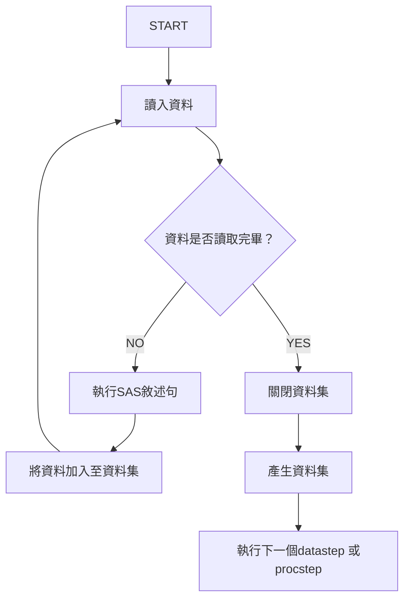

---
參考資料:
---
datastep，簡單來說就是建立、修改、合併、分割、刪除資料集的程式碼區塊。[[SAS]]在進行資料處理的時候，他會建立一個她專屬的格式檔案，這個格式檔案會被稱為[[資料集]]。

因此當SAS要使用資料進行分析的時候，就需要先把原始資料轉換成[[資料集]]。這個過程就是datastep。
- - -

- - -
# 敘述句
要建立一個datastep，我們需要用許多[[SAS敘述句|敘述句]]來建立，以下我有用不同的功能來分類敘述句的功能：
#### 
- - -
parent::[[SAS]],[[資料集]]
sibling::
child::