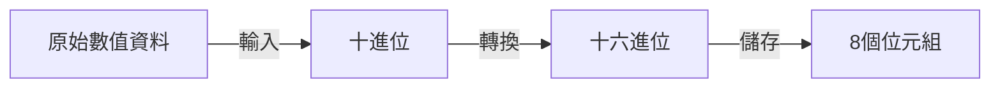

LENGTH，是SAS中用來定義變數儲存長度的[[SAS敘述句|敘述句]]。

當今天資料量很大時，[[變數]]的儲存長度會顯著的影響SAS執行的效率。
倘若變數的儲存長度越長越長，資料的處理則需要花費更多的時間。反之則越短。
- - -
# 背景知識
SAS數值資料的預設儲存讀取方式如下
#### 儲存

#### 讀取

- - -
# 基本語法
```SAS
LENGTH 變數名稱 ($) 儲存長度;
```

- $：若變數為文字型變數，則必須加上"\$"。
- 儲存長度：定義變數儲存長度（位元組），
	- 數值型變數：3-8
	- 文字變數：1-32,767
- - -
# 備註
- 在SAS的預設中，數值變數的儲存長度為8位元組；文字變數的儲存長度則是以第一次出現文字值的位元組數為長度。
- LENGTH敘述句有一個小缺點，==如果資料變成十六位數後，長度長於儲存長度。==則會出現<font color=red>截斷</font>的問題，讓資料跟原始數據有些許差異。這邊以1.3在儲存長度為4的情況為例：
- - -
# 範例
```SAS
data d1;
input x y;
length y 4;
cards;
1.1 1.1
1.2 1.2
1.3 1.3
1.4 1.4
;
data d2;
	set d1;
	put x= y=;
run;
proc print;
run;
```
在這個範例裡面，我們定義了變數y的長度。然後可以藉由同樣變數觀測值在不同長度下，出現的差別。你可以看到，明明是同一個值，在不同長度下的呈現卻不一樣。這是因為資料被截斷了，才會出現些許差別。
- - -
parent::[[SAS敘述句]],[[變數]]
sibling::
child::